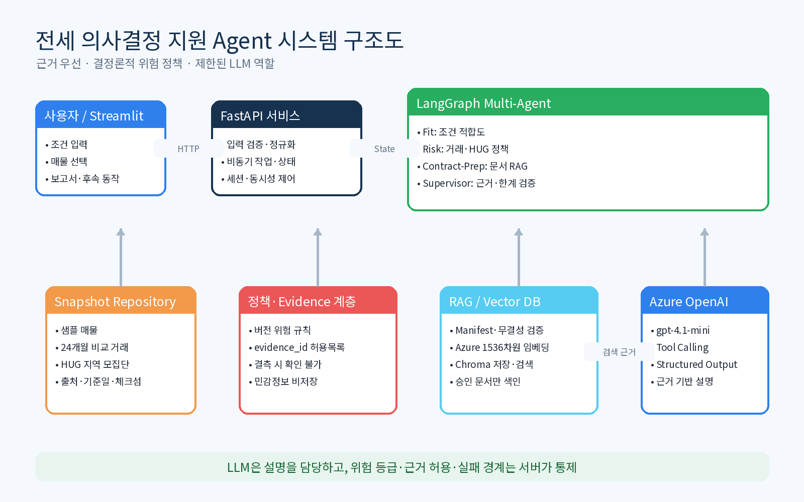
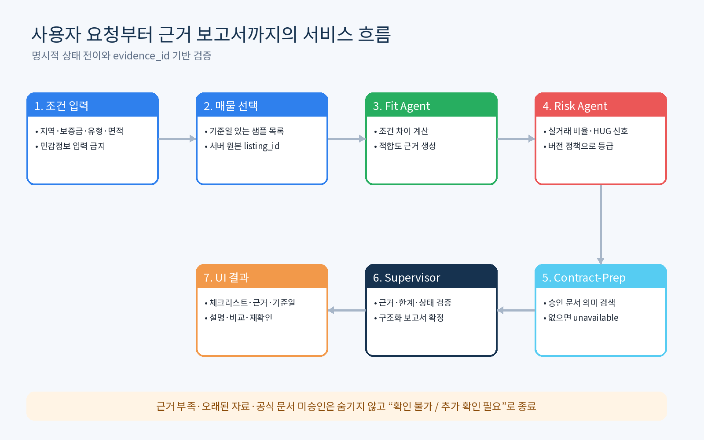
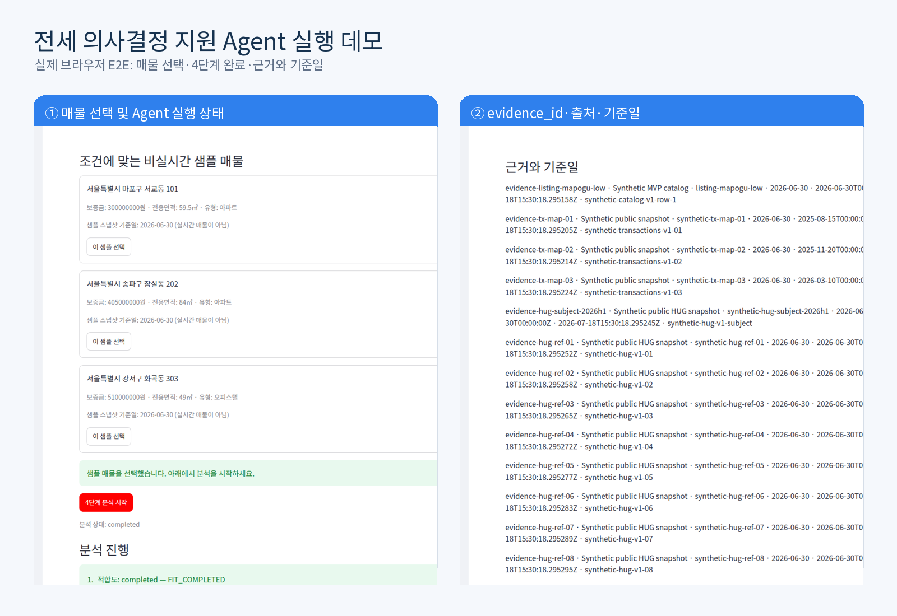

# Jeonse Evidence Agent

근거 우선(Evidence-first) 방식으로 전세 매물 검토를 돕는 LangGraph 기반 Multi-Agent 의사결정 지원 서비스입니다.

> This project is an educational decision-support tool. It is not legal advice, a fraud determination, a safety guarantee, or a substitute for current official records and qualified professionals.



## Why this project

전세 매물을 검토할 때 사용자는 매물 조건, 비교 거래, 지역 보증사고 신호, 계약 준비 문서를 서로 다른 출처에서 확인해야 합니다. 일반적인 LLM 챗봇은 근거가 없는 설명을 생성하거나 최신성을 과장할 수 있습니다.

Jeonse Evidence Agent는 다음 원칙을 적용합니다.

- 위험 등급은 LLM 직관이 아니라 버전이 있는 결정론적 정책으로 계산합니다.
- 주요 주장과 체크 항목은 `evidence_id`, 출처, 기준일을 포함합니다.
- 근거가 부족하거나 오래되면 안전하다고 추정하지 않고 `확인 불가`로 표시합니다.
- LLM은 허용된 근거를 사용자에게 설명하는 제한된 역할만 수행합니다.
- 공식 문서는 이용 조건과 무결성 검증을 통과한 경우에만 색인합니다.

## Multi-Agent workflow

LangGraph는 다음 네 역할을 순차 실행합니다.

1. **Fit Agent** — 사용자 조건과 선택 매물의 지역·보증금·유형·면적 비교
2. **Risk Agent** — 비교 거래 및 HUG 지역 신호를 버전 정책으로 평가
3. **Contract-Prep Agent** — 승인된 공식 문서 RAG를 검색해 확인 항목 생성
4. **Supervisor Agent** — 근거, 상태, 한계 고지를 검증하고 최종 보고서 확정



## Technology

- Python 3.11+
- LangChain / LangGraph
- Azure OpenAI `gpt-4.1-mini`
- Azure OpenAI `text-embedding-3-small`
- Chroma vector database
- FastAPI backend
- Streamlit frontend
- Pydantic structured output
- Tool Calling and bounded ReAct flow
- Typed temporal session memory

## RAG and data boundary

저장소에 포함된 매물·거래·HUG fixture는 **합성 데이터**이며 실제 매물이나 공식 기록이 아닙니다. 공식 사이트 원문은 포함하거나 재배포하지 않습니다.

`data/rag/manifest.yaml`의 공식 문서 레코드는 다음 검증을 요구합니다.

- 출처 allowlist와 이용 조건
- 불변 원문 SHA-256
- 기준시각(`as_of`)
- 페이지 범위
- span offset 및 span SHA-256

승인된 레코드가 없으면 product RAG는 명시적으로 unavailable 상태가 됩니다. Azure 임베딩과 Chroma 경로는 `scripts/provider_smoke.py`로 별도 검증할 수 있습니다.

## Quick start

```bash
python -m venv .venv
. .venv/bin/activate
python -m pip install --upgrade pip
python -m pip install -r requirements.txt
python -m pip install -e . --no-deps
```

FastAPI를 실행합니다.

```bash
uvicorn jeonse_support.api:app --host 127.0.0.1 --port 8000
```

별도 터미널에서 Streamlit을 실행합니다.

```bash
JEONSE_API_BASE_URL=http://127.0.0.1:8000 \
streamlit run streamlit_app.py \
  --server.headless true \
  --server.address 127.0.0.1 \
  --server.port 8501
```

브라우저에서 `http://127.0.0.1:8501`을 엽니다.

## Optional Azure OpenAI configuration

오프라인 합성 스냅샷 데모는 Azure 설정 없이 실행할 수 있습니다. 실제 Azure provider를 검증하려면 `.env.example`에 설명된 환경변수를 모두 설정합니다. 일부만 설정된 경우 애플리케이션은 시작을 거부합니다.

```bash
python scripts/provider_smoke.py
```

Smoke 결과에는 비밀값, endpoint, deployment 식별자 또는 모델 원문 응답을 기록하지 않습니다.

## API lifecycle

`POST /api/v1/analyses`는 `202 Accepted`와 `analysis_id`를 반환합니다. 이후 상태 및 보고서를 조회합니다.

```bash
curl -X POST http://127.0.0.1:8000/api/v1/analyses \
  -H 'Content-Type: application/json' \
  -H 'Idempotency-Key: example-analysis-1' \
  --data '{"session_id":"example-session","listing_id":"listing-mapogu-low"}'

curl http://127.0.0.1:8000/api/v1/analyses/ANALYSIS_ID
curl http://127.0.0.1:8000/api/v1/analyses/ANALYSIS_ID/report
```

후속 동작은 `clarify`, `compare`, `recheck`로 제한되며 자유 텍스트 지시를 Memory에 저장하지 않습니다. 세션은 reset/delete API로 명시적으로 제거할 수 있습니다.

## Verification

```bash
python -m pytest
python -m compileall -q src streamlit_app.py scripts
```

현재 검증 범위에는 단위·통합 테스트 123개, API lifecycle, 동시성·TTL·PII 경계, 정책 우선순위, RAG manifest 무결성, Structured Output 및 UI 계약이 포함됩니다.



## Repository layout

```text
src/jeonse_support/   FastAPI, LangGraph, agents, policy, RAG and adapters
data/                  Synthetic snapshot fixtures and lawful RAG manifest
policies/              Versioned deterministic risk policy
scripts/               Secret-safe provider/Chroma smoke test
streamlit_app.py       Streamlit HTTP client
tests/                 Unit and integration tests
docs/assets/           Architecture, flow and browser demo images
```

## Security and privacy

- 비밀값은 환경변수로만 주입하고 저장소·로그·산출물에 기록하지 않습니다.
- 이름, 연락처, 주민등록번호, 임대인 식별정보 입력을 요구하지 않습니다.
- 공식 자료를 승인 없이 수집하거나 저작권 있는 원문을 번들링하지 않습니다.
- 실제 계약 전에는 최신 등기·건축물·보증·법률 정보를 별도로 확인해야 합니다.

## License

프로젝트 코드는 [MIT License](LICENSE)로 배포합니다. `static/NotoSansKR-Regular.ttf`는 [SIL Open Font License](static/OFL.txt)를 따릅니다. 합성 fixture는 테스트·데모용이며 실제 공공 기록을 나타내지 않습니다.
